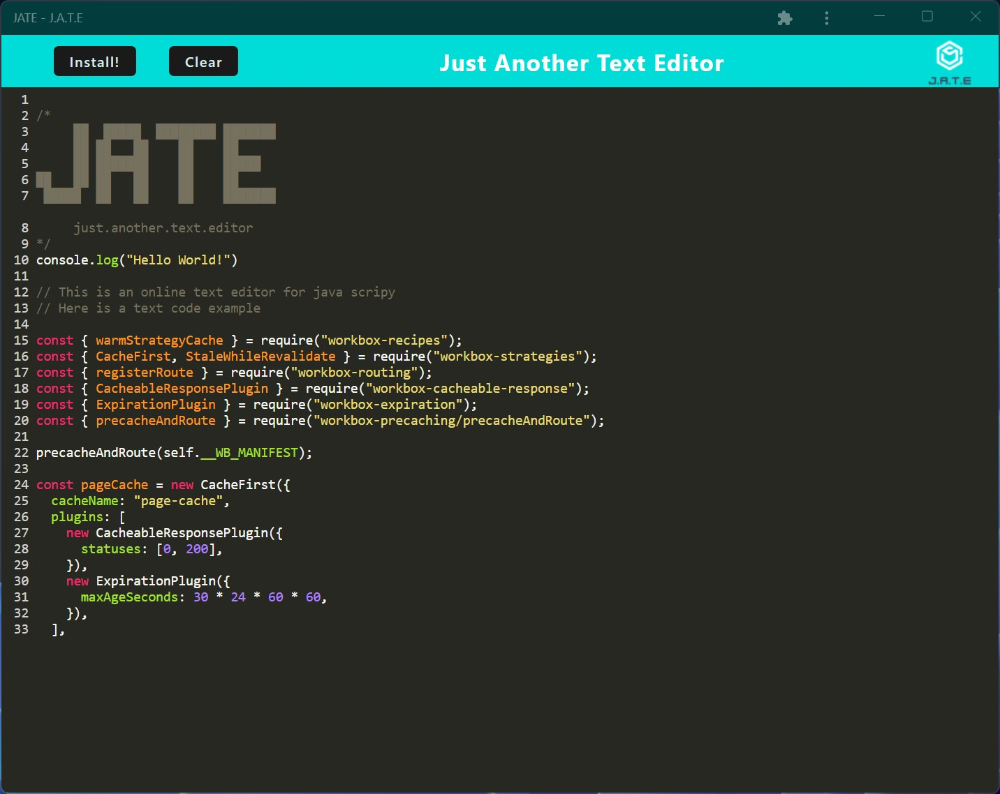

[](https://deepscan.io/dashboard#view=project&tid=19657&pid=23124&bid=691436)[](https://www.codefactor.io/repository/github/danielflores/demployee-track-cms)

# J.A.T.E Web

## Description

J.A.T.E Web is a Progressive Web App that offers a simple interface for creating and editing text on any device. With its minimalistic design, you can focus on writing without any distractions. The app works offline, so you can continue working on your documents even without an internet connection.



## Table of contents

- [Description](#description)
- [Installation](#🛠️installation)
- [Usage](#💻usage)
- [Dependencies](#🧩dependencies)
- [License](#📛license)
- [Contributing](#🤝contributing)
- [Tests](#📃tests)
- [Questions](#❓questions)
- [Website](#🌐website)
- [Programming Languages](#👨‍💻programming-languages)
- [Credits](#👨creadits)

## 🛠️Installation

To install the application clone the repository https://github.com/danielfloresd/jate-web and run node package manager with the following command: ```npm i```.

## 💻Usage

After installing all dependencies run ```npm start``` to launch a webserver.

## 🧩Dependencies
*   "express": "^4.17.1"
*   "concurrently": "^5.2.0",
*   "mini-css-extract-plugin": "^2.7.2",
*   "nodemon": "^2.0.4"

## 📛License

Project license: [MIT](https://choosealicense.com/licenses/mit).

<details><summary><b>View License</b></summary>MIT License

Copyright (c) 2022 Daniel Flores D

Permission is hereby granted, free of charge, to any person obtaining a copy
of this software and associated documentation files (the "Software"), to deal
in the Software without restriction, including without limitation the rights
to use, copy, modify, merge, publish, distribute, sublicense, and/or sell
copies of the Software, and to permit persons to whom the Software is
furnished to do so, subject to the following conditions:

The above copyright notice and this permission notice shall be included in all
copies or substantial portions of the Software.

THE SOFTWARE IS PROVIDED "AS IS", WITHOUT WARRANTY OF ANY KIND, EXPRESS OR
IMPLIED, INCLUDING BUT NOT LIMITED TO THE WARRANTIES OF MERCHANTABILITY,
FITNESS FOR A PARTICULAR PURPOSE AND NONINFRINGEMENT. IN NO EVENT SHALL THE
AUTHORS OR COPYRIGHT HOLDERS BE LIABLE FOR ANY CLAIM, DAMAGES OR OTHER
LIABILITY, WHETHER IN AN ACTION OF CONTRACT, TORT OR OTHERWISE, ARISING FROM,
OUT OF OR IN CONNECTION WITH THE SOFTWARE OR THE USE OR OTHER DEALINGS IN THE
SOFTWARE.

</details></br>

## 🤝Contributing

If you would like to contribute, please follow the [GitHub contribution guidelines](https://github.com/github/docs/blob/main/CONTRIBUTING.md)

## 📃Tests

Testing implemented using jest. To run unit testing ```npm test```

## ❓Questions

For questions, please contact:

- [](https://github.com/danielfloresd)
- [](mailto:daniel.flor3s.d@gmail.com)


## 🌐Website

[JATE Web](https://jate-web.herokuapp.com/)

## 👨‍💻Programming Languages

This project was created with: JavaScript and Webpack

## 👨Credits

Started code provided by the University of Arizona coding bootcamp
